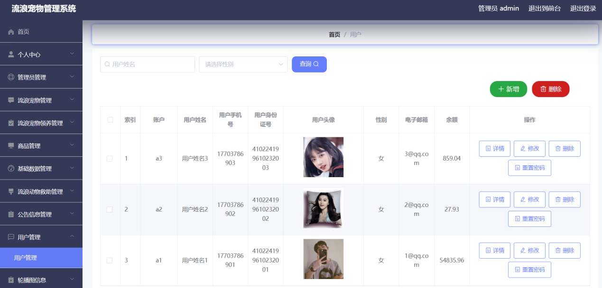

**项目简介：**  
本项目基于主流的前后端分离架构，采用 **SpringBoot + Vue 技术栈**，配套 **MySQL 数据库**，适用于毕业设计与课题实训开发。  
本人已整理了超 **4000 多套毕业设计源码+论文+开题报告+PPT...**，涵盖 **Java、SpringBoot、Vue、SSM、uni-app 小程序、PHP、Android** 等方向，支持功能修改定制与论文服务。  
**团队提供以下服务：**  
- 项目代码修改与调试  
- 数据库配置与远程协助  
- 论文定制与修改  
**获取更多的4000多套源码或SQL文件请联系：**  
- QQ：3906443360 微信：BesheHelp

# springboot179基于javaweb的流浪宠物管理系统的设计与实现

## 4系统设计

4.1系统的总体功能设计

通过结合系统分析阶段的相关内容，对系统的整体功能设计进行规划。由此可知，本系统的使用者主要可以被分为管理员角色和用户角色两类。其中，管理员角色主要的功能需求有用户信息管理、流浪宠物管理、流浪动物救助管理等模块，用户角色主要的功能需求有系统登录、查询流浪宠物信息、查询流浪动物救助信息等模块。本系统的总体功能设计如图4-1所示。

图4-1系统的总体功能设计

4.2数据库设计

4.2.1概念设计

在数据库设计阶段，本系统通过使用开源的、小型的MySQL数据库对系统相关的数据信息进行管理和维护[12]。数据库设计大致可以被分为概念设计和逻辑设计两个阶段。概念设计阶段是逻辑设计阶段的重要依据，同样的，逻辑设计阶段也是概念设计阶段的实现目标。概念设计阶段主要通过使用实体-联系图（E-R图）的方式，将现实世界中用户对系统的实际需求，转换成设计人员能够理解的抽象的数据库概念模型。本人通过设计E-R图，详细的对系统中的实体以及实体之间的联系进行了表达。各实体信息的E-R图如图4-2、图4-3、图4-4、图4-5、图4-6、图4-7、图4-8、图4-9、图4-10、图4-11、图4-12、图4-13、图4-14所示，系统总体E-R图如图4-15所示。

图4-2管理员信息E-R图

图4-3用户信息E-R图

图4-4字典信息E-R图

图4-5商品信息E-R图

图4-6商品订单信息E-R图

图4-7商品评价信息E-R图

图4-8流浪宠物信息E-R图

图4-9流浪宠物领养信息E-R图

图4-10流浪动物救助信息E-R图

图4-11流浪动物救助留言信息E-R图

图4-12流浪动物救助收藏信息E-R图

图4-13购物车信息E-R图

图4-14公告信息E-R图

图4-15系统总体E-R图

4.2.2逻辑设计

逻辑设计阶段主要的工作是将概念设计中的E-R图，转换成方便系统进行存储和管理的二维表格形式[14]。这一阶段也可以被称为数据库的详细设计，其直接关系到系统功能模块的正常运行、数据信息的正常更新等。在设计过程中，需要充分考虑数据库的规范性和合理性，使得能够满足系统的功能和性能需求。本系统相关的数据表格设计内容如下所示。

表4-1管理员信息表

表4-2用户信息表

表4-3字典信息表

表4-4商品信息表

表4-5商品订单信息表

表4-6商品评价信息表

表4-7流浪宠物信息表

表4-8流浪宠物领养信息表

表4-9流浪动物救助信息表

表4-10流浪动物救助留言信息表

表4-11流浪动物救助收藏信息表

表4-12购物车信息表

表4-13公告信息表

5系统实现

5.1个人中心

通过设计的个人中心管理功能模块，管理用户可以对相关的个人信息进行管理，比如管理用户可以更新个人账号的密码信息，修改个人账号的用户名信息等，修改密码界面设计如图5-1所示，个人信息界面设计如图5-2所示。

图5-1修改密码界面

图5-2个人信息界面

5.2管理员管理

通过设计的管理员管理功能模块，管理用户可以对相关的管理员用户信息进行管理，比如管理用户可以查看管理员用户密码信息，更新用户名，删除已经注销的管理员用户信息记录等，管理员管理界面设计如图5-3所示。

图5-3管理员管理界面

5.3流浪宠物管理

通过设计的流浪宠物管理功能模块，管理用户可以对相关的流浪宠物信息进行管理，比如管理用户可以添加新的流浪宠物信息记录，更新宠物名称，删除失效的流浪宠物信息记录等，流浪宠物管理界面设计如图5-4所示。

图5-4流浪宠物管理界面

5.4流浪宠物领养管理

通过设计的流浪宠物领养管理功能模块，管理用户可以对相关的流浪宠物领养信息进行管理，比如管理用户可以添加新的流浪宠物领养信息记录，更新流浪宠物领养用户姓名，删除失效的流浪宠物领养信息记录等，流浪宠物领养管理界面设计如图5-5所示。

图5-5流浪宠物领养管理界面

5.5商品管理

通过设计的商品管理功能模块，管理用户可以对相关的商品、商品评价、商品订单信息进行管理，比如管理用户可以添加新的商品、商品评价、商品订单信息记录，更新商品姓名、评价内容、地址信息，删除失效的商品、商品评价、商品订单信息记录等，商品管理界面设计如图5-6所示，商品评论管理界面设计如图5-7所示，商品订单管理界面设计如图5-8所示。

图5-6商品管理界面

图5-7商品评价管理界面

图5-8商品订单管理界面

5.6基础数据管理

通过设计的基础数据管理功能模块，管理用户可以对相关的宠物类型、商品类型、公告类型信息进行管理，比如管理用户可以添加新的宠物类型、商品类型、公告类型信息记录，更新宠物类型、商品类型、公告类型名称信息，删除失效的宠物类型、商品类型、公告类型信息记录等，宠物类型管理界面设计如图5-9所示，商品类型管理界面设计如图5-10所示，公告类型管理界面设计如图5-11所示。

图5-9宠物类型管理界面

图5-10商品类型管理界面

图5-11公告类型管理界面

5.7流浪动物救助管理

通过设计的流浪动物救助管理功能模块，管理用户可以对相关的流浪动物救助、流浪动物救助留言、流浪动物救助收藏信息进行管理，比如管理用户可以添加新的流浪动物救助、流浪动物救助留言、流浪动物救助收藏信息记录，更新救助标题、留言内容、收藏时间信息，删除失效的流浪动物救助、流浪动物救助留言、流浪动物救助收藏信息记录等，流浪动物救助管理界面设计如图5-12所示，流浪动物救助留言管理界面设计如图5-13所示，流浪动物救助收藏管理界面设计如图5-14所示。

图5-12流浪动物救助管理界面

图5-13流浪动物救助留言管理界面

图5-14流浪动物救助收藏管理界面

5.8公告信息管理

通过设计的公告信息管理功能模块，管理用户可以对相关的公告信息进行管理，比如管理用户可以查看详细的公告内容信息，删除失效的公告信息记录等，公告信息管理界面设计如图5-15所示。

图5-15新闻公告管理界面

5.9用户管理

通过设计的用户管理功能模块，管理用户可以对相关的用户信息进行管理，比如管理用户可以查看用户头像信息，更新用户手机号码，删除已经注销的用户信息记录等，用户管理界面设计如图5-16所示。

图5-16用户管理界面

5.10轮播图管理

通过设计的轮播图管理功能模块，管理用户可以对相关的轮播图信息进行管理，比如管理用户可以查看轮播图信息，删除失效的轮播图信息记录等，轮播图管理界面设计如图5-17所示。

图5-17轮播图管理界面

